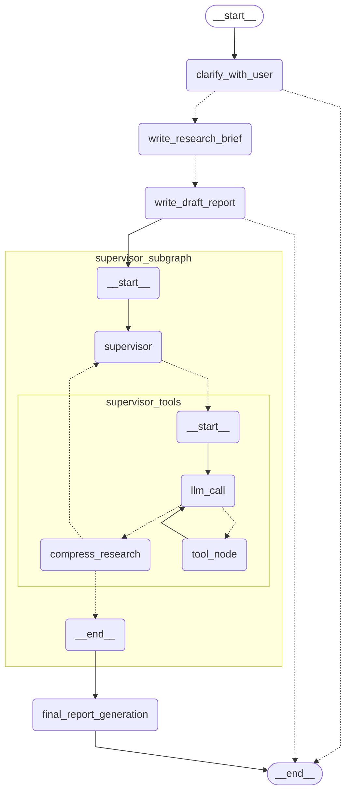

## Deep Research
A deep research agent that can clarify user requirements, write a research brief, draft a report, and generate a final report after supervisor review.

### Flowchart

```mermaid
---
config:
  flowchart:
    curve: linear
---
graph TD;
	__start__([<p>__start__</p>]):::first
	clarify_with_user(clarify_with_user)
	write_research_brief(write_research_brief)
	write_draft_report(write_draft_report)
	final_report_generation(final_report_generation)
	__end__([<p>__end__</p>]):::last
	__start__ --> clarify_with_user;
	clarify_with_user -.-> __end__;
	clarify_with_user -.-> write_research_brief;
	supervisor_subgraph\3a__end__ --> final_report_generation;
	write_draft_report -.-> __end__;
	write_draft_report --> supervisor_subgraph\3a__start__;
	write_research_brief -.-> write_draft_report;
	final_report_generation --> __end__;
	subgraph supervisor_subgraph
	supervisor_subgraph\3a__start__(<p>__start__</p>)
	supervisor_subgraph\3asupervisor(supervisor)
	supervisor_subgraph\3a__end__(<p>__end__</p>)
	supervisor_subgraph\3a__start__ --> supervisor_subgraph\3asupervisor;
	supervisor_subgraph\3asupervisor -.-> supervisor_subgraph\3asupervisor_tools\3a__start__;
	supervisor_subgraph\3asupervisor_tools\3acompress_research -.-> supervisor_subgraph\3a__end__;
	supervisor_subgraph\3asupervisor_tools\3acompress_research -.-> supervisor_subgraph\3asupervisor;
	subgraph supervisor_tools
	supervisor_subgraph\3asupervisor_tools\3a__start__(<p>__start__</p>)
	supervisor_subgraph\3asupervisor_tools\3allm_call(llm_call)
	supervisor_subgraph\3asupervisor_tools\3atool_node(tool_node)
	supervisor_subgraph\3asupervisor_tools\3acompress_research(compress_research)
	supervisor_subgraph\3asupervisor_tools\3a__start__ --> supervisor_subgraph\3asupervisor_tools\3allm_call;
	supervisor_subgraph\3asupervisor_tools\3allm_call -.-> supervisor_subgraph\3asupervisor_tools\3acompress_research;
	supervisor_subgraph\3asupervisor_tools\3allm_call -.-> supervisor_subgraph\3asupervisor_tools\3atool_node;
	supervisor_subgraph\3asupervisor_tools\3atool_node --> supervisor_subgraph\3asupervisor_tools\3allm_call;
	end
	end
	classDef default fill:#f2f0f,line-height:1.2
	classDef first fill-opacity:0
	classDef last fill:#bfb6f

```
