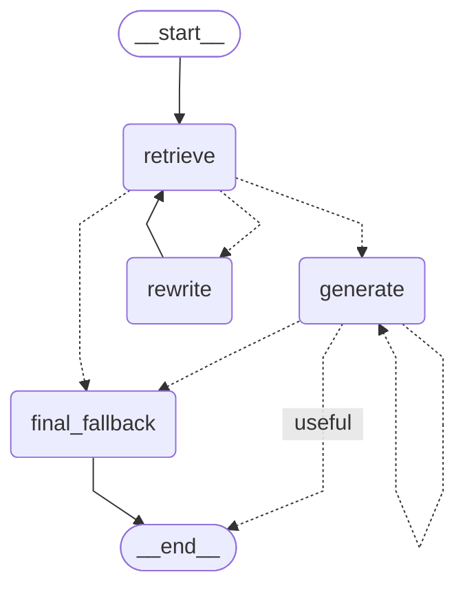

# Deep Research Agent System

A sophisticated multi-agent research system that performs in-depth research with automated clarification, research planning, parallel task execution, and comprehensive report generation. The project includes both a deep research agent and a self-correcting RAG (Retrieval-Augmented Generation) agent powered by LangChain and LangGraph.

## Project Overview

The Deep Research Agent System is an advanced AI-powered multi-agent framework designed to conduct comprehensive research on complex topics. It employs a hierarchical agent architecture with specialized roles for scoping, supervision, research execution, and report generation. The system is built on LangChain/LangGraph and integrates with AWS Bedrock (using Meta's Llama 4 Maverick model) and Milvus vector database for enhanced knowledge retrieval.

### Key Capabilities

- **Intelligent Clarification**: Automatically detects ambiguous research requests and asks clarifying questions
- **Research Planning**: Generates detailed research briefs to guide the investigation
- **Parallel Research Execution**: Supervisor agent delegates tasks to multiple researcher agents working concurrently
- **Self-Correcting RAG**: Vector database-powered question answering with document grading and hallucination detection
- **Comprehensive Reporting**: Multi-stage report generation with draft refinement and final synthesis
- **Strategic Reflection**: Built-in "think" tool for deliberate research planning and quality control

## Architecture

### Deep Research Agent

The deep research agent implements a sophisticated multi-stage workflow with specialized sub-agents:

1.  **Clarify with User (`clarify_with_user`)**: 
    - Analyzes user messages to detect unclear research scopes
    - Can be configured to skip clarification via `allow_clarification` flag
    - Uses structured output (`ClarifyWithUser`) to determine if questions are needed
    - Routes to either clarifying questions (END) or proceeds to research brief

2.  **Write Research Brief (`write_research_brief`)**: 
    - Transforms conversation history into a structured research brief
    - Uses `ResearchQuestion` structured output for consistency
    - Extracts key research objectives and scope

3.  **Write Draft Report (`write_draft_report`)**: 
    - Initializes the research process
    - Routes to supervisor subgraph for task delegation

4.  **Supervisor Subgraph**: A nested graph managing the research execution:
    - **Supervisor Node**: Plans research strategy, delegates tasks using tools:
      - `ConductResearch`: Launches parallel researcher agents (up to 5 concurrent)
      - `think_tool`: Strategic reflection on progress
      - `ResearchComplete`: Signals research completion
    - **Supervisor Tools Node**: Executes supervisor decisions:
      - Launches researcher agents in parallel
      - Aggregates findings from all researchers
      - Manages iteration limits (max 15 iterations)
    - **Compress Research**: Condenses findings for supervisor review

5.  **Researcher Agent**: Individual research agents with React-style loop:
    - **LLM Call**: Decides next actions (search or answer)
    - **Tool Node**: Executes tools (Tavily search, Milvus search, think_tool)
    - **Compress Research**: Summarizes findings
    - Supports up to 10 tool calls per iteration

6.  **Final Report Generation**: 
    - Synthesizes all research findings
    - Uses specialized writer model for comprehensive output
    - Incorporates research brief, draft report, and all notes

### RAG Agent (Self-Correcting)

The RAG agent implements a graph-based workflow with quality control:

1.  **Retrieve**: 
    - Fetches relevant documents from Milvus vector database
    - Uses reranking for improved relevance

2.  **Grade Documents**: 
    - Evaluates document relevance using `GradeDocuments` structured output
    - Routes to query rewriting if documents are not relevant
    - Max 3 retries before fallback

3.  **Generate**: 
    - Produces answers based on retrieved documents
    - Uses context-aware prompting with source documents

4.  **Grade Generation**: 
    - Checks for hallucinations using `GradeHallucination` structured output
    - Validates answer relevance to question
    - Max 15 invocations before fallback

5.  **Rewrite Query**: 
    - Reformulates question for better vector search results
    - Loops back to retrieval

6.  **Final Fallback**: 
    - Returns failure message if quality thresholds not met

### Flowchart Deep Research Agent


### Flowchart RAG Agent



## File-by-File Breakdown

### `main.py`

The entry point of the application. Contains two main functions:
- `deep_research()`: Runs the deep research agent asynchronously with configurable settings
- `rag_milvus_agent()`: Runs the RAG agent for question answering

Configures models (AWS Bedrock Llama 4 Maverick), tools (Tavily search, think_tool), and thread management.

### Core Agent Files (`src/`)

#### `agent_deep_research.py`
- Defines the main graph structure for the deep research agent
- Implements `final_report_generation` node for synthesizing final output
- Builds the workflow using StateGraph with proper node connections
- Manages state transitions between clarification, briefing, supervision, and reporting

#### `agent_rag.py`
- Implements the self-correcting RAG agent graph
- Defines state management for RAG workflow
- Implements nodes:
  - `retrieve`: Fetches documents using reranking
  - `generate`: Creates answers from retrieved context
  - `grade_documents`: Validates document relevance
  - `grade_hallucination`: Checks answer quality
  - `rewrite_query`: Improves search queries
  - `final_fallback`: Handles max retry scenarios

#### `configuration.py`
- Comprehensive configuration management using Pydantic
- Key settings:
  - `llm`: Base language model configuration
  - `allow_clarification`: Toggle for clarification step
  - `context_window`: LLM token limits (default: 1,048,576)
  - `max_concurrent_research_units`: Parallel researcher limit (default: 5)
  - `max_researcher_iterations`: Supervisor iteration limit (default: 15)
  - `max_react_tool_calls`: Tool calls per researcher (default: 10)
  - `max_structured_output_retries`: Retry logic for structured outputs (default: 3)
- Provides model factory methods: `get_model()`, `model_with_tool()`, `writer_model()`, `creative_model()`
- Includes `from_runnable_config()` for extracting config from LangGraph context

#### `utility.py`
- Core utility functions:
  - `think_tool`: Strategic reflection tool for research planning
  - `tavily_search`: Web search integration via Tavily API
  - `get_today_str()`: Current date formatting
  - `get_notes_from_tool_calls()`: Extract research findings
  - `refine_draft_report()`: Draft report enhancement
  - `bind_toolchain_model()`: Tool binding utilities
- Configures model instances and API clients

#### `logger.py`
- Centralized logging configuration
- File-based logging to `logs/` directory with date-based rotation
- Supports debug and info level logging across all modules

#### `constant.py`
- Project-wide constants and configuration values

### Deep Research Sub-agents (`src/deep_research/`)

#### `agent_scope.py`
- **`clarify_with_user`**: Analyzes ambiguity, asks questions if needed
- **`write_research_brief`**: Converts conversation to structured research brief
- **`write_draft_report`**: Initiates supervisor workflow for research execution
- Uses structured outputs: `ClarifyWithUser`, `ResearchQuestion`, `DraftReport`

#### `agent_supervisor.py`
- **`supervisor`**: Lead researcher coordinating research strategy
  - Plans task delegation using `ConductResearch` tool
  - Reflects using `think_tool`
  - Signals completion via `ResearchComplete`
  - Manages concurrent research units (up to 5 parallel)
- **`supervisor_tools`**: Executes supervisor decisions
  - Launches parallel researcher agents via asyncio
  - Aggregates findings from all researchers
  - Compresses research for supervisor review
  - Enforces iteration limits

#### `agent_research.py`
- Individual researcher agent implementing React pattern:
  - **`llm_call`**: Decides on tool usage or final answer
  - **`tool_node`**: Executes research tools (search, think)
  - **`compress_research`**: Summarizes findings for supervisor
  - **`should_continue`**: Routes between tool calls and completion
- Creates nested StateGraph for researcher workflow
- Supports configurable tool sets via Configuration

#### `state.py`
- Pydantic models and TypedDict definitions for state management:
  - `AgentState`: Main state with messages, notes, reports
  - `AgentInputState`: Input schema with just messages
  - `SupervisorState`: Supervisor-specific state
  - `ResearcherState`: Researcher-specific state with tool messages
  - `ResearchQuestion`: Structured research brief
  - `ClarifyWithUser`: Clarification analysis output
  - `ConductResearch`: Tool for launching sub-researchers
  - `ResearchComplete`: Completion signal
  - `DraftReport`: Initial report structure
  - `Summary`: Research summary format
- Custom reducers: `override_reducer` for state override functionality

### Prompts (`src/prompts/`)

All prompt templates are centralized here for maintainability:

- **`prompt_final.py`**: Final report generation with helpfulness/insightfulness criteria
- **`prompt_rag.py`**: RAG-specific prompts (system instructions, grading prompts)
- **`prompt_research.py`**: Researcher agent prompts, compression prompts
- **`prompt_scope.py`**: Clarification and research brief prompts, draft report prompts
- **`prompt_supervisor.py`**: Supervisor planning prompts with multi-step diffusion logic
- **`prompt_utility.py`**: Utility prompts (webpage summarization, report generation)

### Milvus Integration (`src/langchain_milvus/`)

Vector database integration for RAG functionality:

#### `constant.py`
- Milvus connection constants: URI, database name, collection name
- Embedding model configuration

#### `db.py`
- Vector store creation and management functions
- Connection handling for Milvus instances

#### `chunking.py`
- Text splitting strategies for document processing
- Semantic chunking for better retrieval

#### `ingest_data.py`
- Functions for adding documents to Milvus
- Batch processing for large datasets

#### `process.py`
- Script for processing and ingesting files into Milvus
- Supports multiple document formats

#### `searching.py`
- Various search implementations:
  - Similarity search
  - MMR (Maximal Marginal Relevance)
  - Metadata filtering
  - Reranking for improved relevance (`search_retrieve_rerank`)

#### `rag.py`
- Complete RAG pipeline implementation
- Combines retriever with language model
- Multiple prompt templates for different use cases

#### `tools_utils.py`
- High-level tool definitions:
  - `milvus_search`: Vector store search tool
  - `rag_milvus`: Complete RAG search tool
- Integrates with LangChain tool ecosystem

#### `utility.py`
- AWS Bedrock embeddings initialization
- Helper functions for Milvus operations

#### `server.py`
- Database and collection management
- Admin operations for Milvus

#### `test.py`
- Test scripts for Milvus functionality

### MCP Client (`src/mcp_client/`)

#### `client.py`
- Model Context Protocol client implementation
- Enables integration with external context providers

## Setup and Usage

### Prerequisites

- Python 3.12 or higher
- AWS Account with Bedrock access (for Llama 4 Maverick model)
- Tavily API key for web search
- Milvus instance (or Milvus Lite for local development)

### Installation

1. **Install UV (recommended) or pip**:
   ```bash
   # Using UV (faster)
   pip install uv
   uv sync
   
   # Or using pip
   pip install -r requirements.txt
   ```

2. **Set up Environment Variables**:
   Create a `.env` file in the root directory:
   ```env
   # AWS Bedrock Configuration
   AWS_ACCESS_KEY_ID=your_access_key
   AWS_SECRET_ACCESS_KEY=your_secret_key
   AWS_DEFAULT_REGION=us-west-2
   
   # Tavily Search API
   TAVILY_API_KEY=your_tavily_api_key
   
   # Milvus Configuration (if using remote Milvus)
   MILVUS_URI=http://localhost:19530
   MILVUS_DB_NAME=your_database
   MILVUS_COLLECTION_NAME=your_collection
   ```

3. **Initialize Milvus Database** (for RAG functionality):
   ```bash
   # Process and ingest documents
   python src/langchain_milvus/process.py
   
   # Or manage database manually
   python src/langchain_milvus/server.py
   ```

### Running the Agents

#### Deep Research Agent

```python
import asyncio
from main import deep_research

# Run with default configuration
asyncio.run(deep_research())
```

**Configuration Options**:
```python
config: RunnableConfig = {
    "configurable": {
        "llm": model,                      # Your LLM instance
        "allow_clarification": False,      # Skip clarification step
        "researcher_tools": tools,         # List of tools for researchers
        "thread_id": thread_id,            # Session tracking
        "max_concurrent_research_units": 5,  # Parallel researchers
        "max_researcher_iterations": 15,   # Supervisor iterations
        "max_react_tool_calls": 10,        # Tools per researcher
    },
    "recursion_limit": 50,
}
```

#### RAG Agent

```python
from main import rag_milvus_agent

# Run RAG agent
rag_milvus_agent()
```

**Custom Query**:
```python
from src.agent_rag import rag_agent
from langchain.chat_models import init_chat_model

model = init_chat_model("bedrock_converse:us.meta.llama4-maverick-17b-instruct-v1:0")
config = {"configurable": {"llm": model}, "recursion_limit": 100}
inputs = {"question": "Your question here"}
output = rag_agent.invoke(inputs, config=config)
print(output.get("generation"))
```

### Using Custom Tools

Add custom tools to the researcher agents:

```python
from langchain_core.tools import tool

@tool
def custom_search(query: str) -> str:
    """Your custom search implementation"""
    return "search results"

tools = [tavily_search, think_tool, custom_search, milvus_search]
config["configurable"]["researcher_tools"] = tools
```

## Tools

The agent system uses the following tools to perform research:

### Research Tools

-   **`tavily_search`**: 
    - Web search tool using the Tavily API
    - Provides real-time web search results
    - Automatically integrated for researcher agents
    - Returns structured search results with sources

-   **`think_tool`**: 
    - Strategic reflection tool for research planning
    - Creates deliberate pauses in workflow for quality decision-making
    - Used for analyzing findings, assessing gaps, and planning next steps
    - Helps maintain research quality and coherence

-   **`milvus_search`**: 
    - Vector store search tool for Milvus database
    - Retrieves relevant documents based on semantic similarity
    - Supports metadata filtering and similarity thresholds
    - Provides source attribution for retrieved content

-   **`rag_milvus`**: 
    - Complete RAG search tool combining retrieval and generation
    - Uses Milvus vector store with language model
    - Implements reranking for improved relevance
    - Returns contextualized answers with source citations

### Tool Configuration

Tools can be configured via the `Configuration` class:

```python
from src.utility import tavily_search, think_tool
from src.langchain_milvus.tools_utils import milvus_search

# Configure tools for researcher agents
tools = [tavily_search, think_tool, milvus_search]
config["configurable"]["researcher_tools"] = tools
```

### Custom Tool Integration

Create custom tools using LangChain's `@tool` decorator:

```python
from langchain_core.tools import tool

@tool
def custom_api_search(query: str) -> str:
    """Searches a custom API for information"""
    # Your implementation here
    return results
```

## Dependencies

The project uses the following key dependencies:

- **langchain** (>=1.1.3): Core LangChain framework
- **langgraph** (>=1.0.5): Graph-based agent orchestration
- **langchain-aws** (>=1.1.0): AWS Bedrock integration
- **langchain-milvus** (>=0.3.2): Milvus vector store integration
- **langchain-tavily** (>=0.2.15): Tavily search integration
- **boto3** (>=1.42.9): AWS SDK for Python
- **pymilvus[milvus-lite]** (>=2.6.5): Milvus client library
- **sentence-transformers** (>=5.2.0): Embedding models
- **tavily-python** (>=0.7.16): Tavily API client

Full list available in `pyproject.toml`

## Project Structure

```
D:\AI\portf/
├── main.py                     # Application entry point
├── pyproject.toml              # Project dependencies and metadata
├── README.md                   # This file
├── uv.lock                     # UV package lock file
├── doc/                        # Documentation and research papers
│   ├── 1409.0473v7.pdf
│   └── 1706.03762v7.pdf
├── logs/                       # Application logs
│   ├── 20251220.log
│   ├── 20251221.log
│   └── 20251222.log
└── src/                        # Source code
    ├── agent_deep_research.py  # Main deep research agent
    ├── agent_rag.py            # Self-correcting RAG agent
    ├── configuration.py        # Configuration management
    ├── constant.py             # Project constants
    ├── logger.py               # Logging configuration
    ├── utility.py              # Utility functions and tools
    ├── deep_research/          # Deep research sub-agents
    │   ├── agent_research.py   # Individual researcher agent
    │   ├── agent_scope.py      # Clarification and scoping
    │   ├── agent_supervisor.py # Research supervisor
    │   └── state.py            # State definitions
    ├── langchain_milvus/       # Milvus integration
    │   ├── chunking.py         # Text chunking strategies
    │   ├── constant.py         # Milvus constants
    │   ├── db.py               # Database management
    │   ├── ingest_data.py      # Data ingestion
    │   ├── process.py          # Document processing
    │   ├── prompt.py           # RAG prompts
    │   ├── rag.py              # RAG pipeline
    │   ├── README.md           # Milvus integration docs
    │   ├── searching.py        # Search implementations
    │   ├── server.py           # Database server management
    │   ├── test.py             # Test scripts
    │   ├── tools_utils.py      # Tool definitions
    │   └── utility.py          # Milvus utilities
    ├── mcp_client/             # Model Context Protocol client
    │   └── client.py
    └── prompts/                # Prompt templates
        ├── prompt_final.py     # Final report prompts
        ├── prompt_rag.py       # RAG prompts
        ├── prompt_research.py  # Research prompts
        ├── prompt_scope.py     # Scoping prompts
        ├── prompt_supervisor.py # Supervisor prompts
        └── prompt_utility.py   # Utility prompts
```

## Configuration Parameters

### Deep Research Agent Configuration

| Parameter | Default | Description |
|-----------|---------|-------------|
| `allow_clarification` | `True` | Enable/disable clarification step |
| `max_structured_output_retries` | `3` | Retries for structured outputs |

### RAG Agent Configuration

| Parameter | Default | Description                    |
|-----------|---------|--------------------------------|
| `recursion_limit` | `100`   | Graph recursion limit          |
| `max_structured_output_retries` | `3`     | Retries for structured outputs |
| `max_retry_times` | `3`     | Max document grading attempts  |
| `max_invocations` | `20`    | Max invocation                 |

## Error Handling

The system includes comprehensive error handling:

- **Structured Output Retries**: Automatic retry on parsing failures
- **Iteration Limits**: Prevents infinite loops in research cycles
- **Fallback Mechanisms**: Graceful degradation when quality checks fail
- **Logging**: Detailed logs in `logs/` directory for debugging

## Contributing

When contributing to this project:

1. Follow the existing code structure and naming conventions
2. Add comprehensive docstrings to all functions
3. Update prompts in the `src/prompts/` directory
4. Test with both deep research and RAG agents
5. Update this README with any new features or changes


